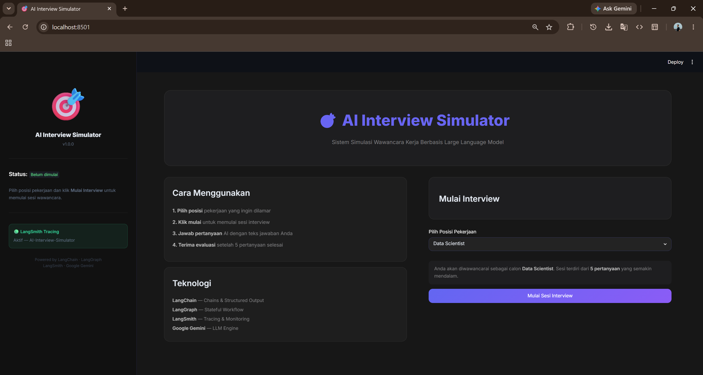
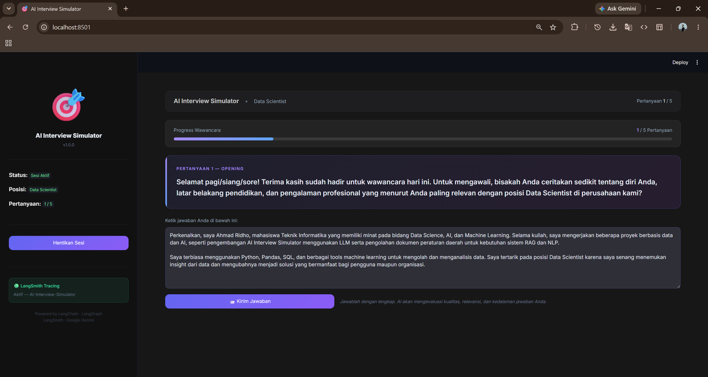
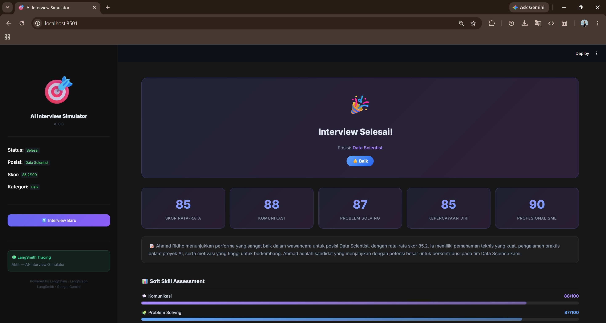
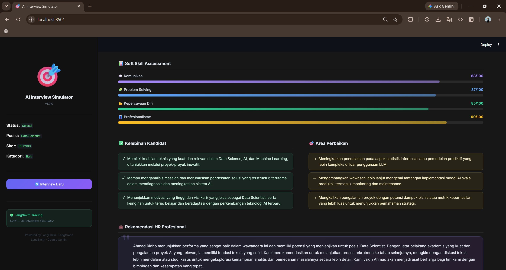
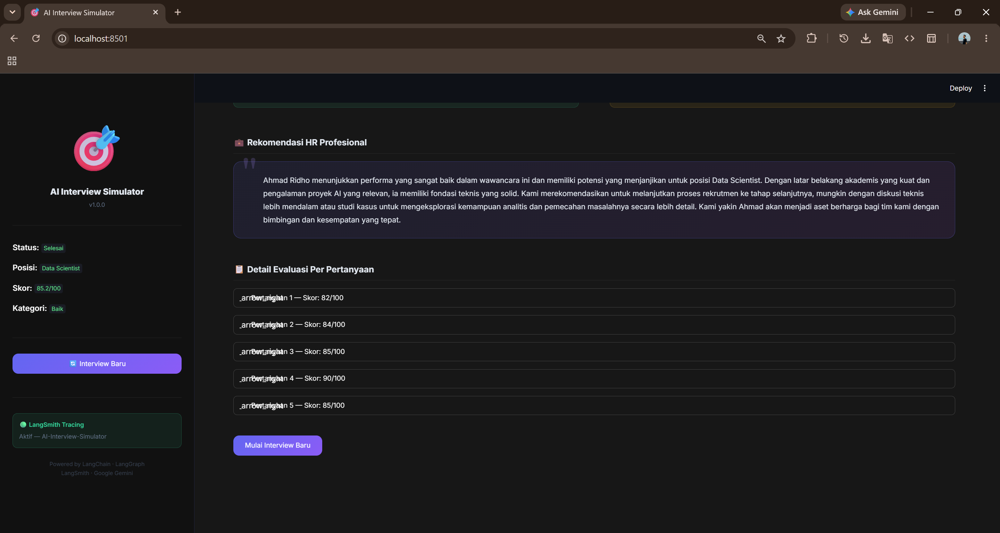
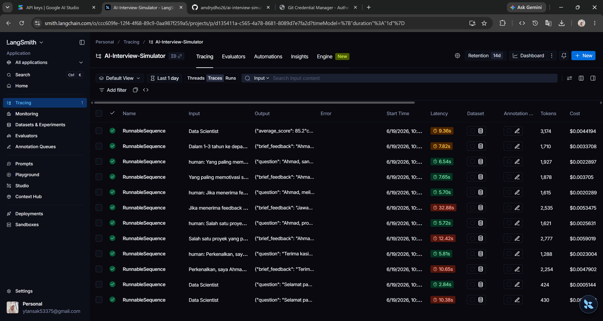

# AI Interview Simulator

<div align="center">

**Sistem Simulasi Wawancara Kerja Berbasis Large Language Model**

*Menggunakan LangChain · LangGraph · LangSmith · Google Gemini · Streamlit*


</div>

---

## 📋 Deskripsi Proyek

**AI Interview Simulator** adalah sistem simulasi wawancara kerja berbasis AI yang membantu calon kandidat berlatih menghadapi wawancara secara realistis. Sistem ini menggunakan **Large Language Model (Google Gemini)** yang dikombinasikan dengan **LangChain**, **LangGraph**, dan **LangSmith** untuk menghasilkan pengalaman interview yang autentik, terstruktur, dan dapat dievaluasi secara objektif.

### 🎯 Tujuan Sistem

| Tujuan | Deskripsi |
|--------|-----------|
| **Latihan Interview** | Simulasi wawancara realistis dengan AI sebagai HRD profesional |
| **Evaluasi Objektif** | Setiap jawaban dinilai dengan skor 0-100 dan feedback konstruktif |
| **Laporan Komprehensif** | Laporan akhir mencakup soft skill, kelebihan, dan rekomendasi |
| **Monitoring Terpadu** | Seluruh proses dapat dipantau melalui LangSmith dashboard |

---

## 🏗️ Arsitektur Sistem

```
┌─────────────────────────────────────────────────────────────┐
│                    AI Interview Simulator                   │
│                                                             │
│  ┌──────────────────────────────────────────────────────┐   │
│  │                  STREAMLIT UI (app.py)               │   │
│  │  ┌────────────┐  ┌─────────────────┐  ┌──────────┐   │   │
│  │  │  Setup     │  │   Interview     │  │ Results  │   │   │
│  │  │  Page      │  │   Page          │  │ Page     │   │   │
│  │  └────────────┘  └─────────────────┘  └──────────┘   │   │
│  └──────────────────────────────────────────────────────┘   │
│                           │                                 │
│  ┌──────────────────────────────────────────────────────┐   │
│  │               LANGGRAPH WORKFLOW (graph.py)          │   │
│  │                                                      │   │
│  │   START → generate_question → [user_input]           │   │
│  │          → evaluate_answer → check_count             │   │
│  │              ├─ < 5 → generate_question (loop)       │   │
│  │              └─ = 5 → generate_final_report → END    │   │
│  └──────────────────────────────────────────────────────┘   │
│                           │                                 │
│  ┌──────────────────────────────────────────────────────┐   │
│  │              LANGCHAIN CHAINS (prompts.py)           │   │
│  │                                                      │   │
│  │  ┌──────────────────────────────────────────────┐    │   │
│  │  │  INTERVIEW_PROMPT | LLM | InterviewQuestion  │    │   │
│  │  │  EVALUATION_PROMPT | LLM | AnswerEvaluation  │    │   │
│  │  │  FINAL_REPORT_PROMPT | LLM | FinalReport     │    │   │
│  │  └──────────────────────────────────────────────┘    │   │
│  └──────────────────────────────────────────────────────┘   │
│                           │                                 │
│  ┌──────────────────────────────────────────────────────┐   │
│  │              PYDANTIC MODELS (models.py)             │   │
│  │                                                      │   │
│  │   InterviewQuestion  AnswerEvaluation  FinalReport   │   │
│  │   SoftSkillScores    QAPair                          │   │
│  └──────────────────────────────────────────────────────┘   │
│                           │                                 │
│  ┌──────────────────────────────────────────────────────┐   │
│  │              GOOGLE GEMINI API                       │   │
│  │         (ChatGoogleGenerativeAI — gemini-2.5-flash)  │   │
│  └──────────────────────────────────────────────────────┘   │
│                           │                                 │
│  ┌──────────────────────────────────────────────────────┐   │
│  │              LANGSMITH TRACING                       │   │
│  │         (Monitoring & Observability Dashboard)       │   │
│  └──────────────────────────────────────────────────────┘   │
└─────────────────────────────────────────────────────────────┘
```

---

## 🔄 LangGraph Workflow

```
        ┌─────────┐
        │  START  │
        └────┬────┘
             │
    ┌────────▼─────────┐
    │  generate_        │  ◄────────────┐
    │  question         │               │
    └────────┬──────────┘               │
             │                          │
    [User input via Streamlit]          │
             │                          │
    ┌────────▼──────────┐               │
    │  evaluate_        │               │
    │  answer           │               │
    └────────┬──────────┘               │
             │                          │
    ┌────────▼──────────┐               │
    │  check_question_  │               │
    │  count            │               │
    └────┬──────────────┘               │
         │                              │
    ┌────▼────┐    question < 5         │
    │  < 5?   ├────────────────────────►┘
    └────┬────┘
         │  question = 5
    ┌────▼──────────────┐
    │  generate_        │
    │  final_report     │
    └────────┬──────────┘
             │
        ┌────▼────┐
        │   END   │
        └─────────┘
```

---

## 🛠️ Teknologi yang Digunakan

### LangChain
**LangChain** digunakan sebagai framework utama untuk:
- **`ChatPromptTemplate`** — Membuat template prompt yang terstruktur dengan variable injection
- **`ChatGoogleGenerativeAI`** — Wrapper untuk model Google Gemini
- **`.with_structured_output()`** — Memaksa output LLM mengikuti schema Pydantic
- **Chain composition** (`|` operator) — Menghubungkan prompt → LLM → parser dalam satu pipeline

**Contoh penggunaan di kode:**
```python
# prompts.py & graph.py
question_chain = INTERVIEW_PROMPT | llm.with_structured_output(InterviewQuestion)
result = question_chain.invoke({"job_role": "Data Scientist", ...})
```

### LangGraph
**LangGraph** digunakan sebagai workflow engine untuk:
- **`StateGraph`** — Mendefinisikan graph dengan state management
- **`TypedDict` State** — `InterviewState` sebagai shared memory antar node
- **Node functions** — `generate_question`, `evaluate_answer`, `generate_final_report`
- **`add_conditional_edges`** — Routing dinamis berdasarkan `question_count`
- **`START` & `END`** — Entry dan exit point graph

**Contoh penggunaan di kode:**
```python
# graph.py
builder = StateGraph(InterviewState)
builder.add_node("generate_question", generate_question)
builder.add_node("evaluate_answer", evaluate_answer)
builder.add_node("generate_final_report", generate_final_report)

builder.add_edge(START, "generate_question")
builder.add_conditional_edges(
    source="evaluate_answer",
    path=check_question_count,
    path_map={
        "generate_question": "generate_question",
        "generate_final_report": "generate_final_report",
    }
)
```

### LangSmith
**LangSmith** digunakan untuk:
- **Tracing** — Setiap LLM call, chain run, dan graph execution ter-trace otomatis
- **Monitoring** — Memantau latency, token usage, dan error rate
- **Debugging** — Inspeksi input/output setiap node secara detail
- **Project Management** — Semua trace dikumpulkan dalam project `AI-Interview-Simulator`

**Konfigurasi di kode:**
```python
# config.py — LangSmith aktif otomatis via environment variables
os.environ["LANGCHAIN_TRACING_V2"] = "true"
os.environ["LANGCHAIN_PROJECT"] = "AI-Interview-Simulator"
os.environ["LANGCHAIN_API_KEY"] = "your_api_key"
```

**Trace yang muncul di LangSmith Dashboard:**
- `generate_question` → ChatGoogleGenerativeAI → InterviewQuestion output
- `evaluate_answer` → ChatGoogleGenerativeAI → AnswerEvaluation output
- `generate_final_report` → ChatGoogleGenerativeAI → FinalReport output

### Google Gemini
**Gemini 2.5 Flash** dipilih karena:
- Mendukung **structured output** (JSON mode) secara native
- **Kecepatan tinggi** dengan biaya rendah
- **Context window besar** untuk mempertahankan riwayat percakapan
- Integrasi native dengan LangChain via `langchain-google-genai`

### Streamlit
**Streamlit** digunakan untuk antarmuka web dengan fitur:
- **Multi-phase UI** — Setup, Interview, Results
- **Session State** — Persistensi data antar interaksi
- **Custom CSS** — Dark glassmorphism design
- **Real-time feedback** — Spinner, progress bar, metric cards

---

## 📁 Struktur Folder

```
ai-interview-simulator/
│
├── app.py              # Streamlit UI — Entry point aplikasi
├── graph.py            # LangGraph workflow — State & nodes
├── prompts.py          # LangChain prompts — 3 prompt templates
├── models.py           # Pydantic models — Structured output schemas
├── config.py           # Konfigurasi — Env variables & constants
│
├── requirements.txt    # Python dependencies
├── .env.example        # Template environment variables
├── .gitignore          # Git ignore rules
│
├── screenshots/        # Screenshot aplikasi
│   └── .gitkeep
│
└── README.md           # Dokumentasi ini
```

---

## ⚙️ Cara Instalasi

### Prasyarat
- Python 3.11 atau lebih baru
- Google API Key (Gemini)
- LangSmith API Key (opsional, untuk tracing)

### Langkah 1: Clone Repository

```bash
git clone https://github.com/amdrydho26/ai-interview-simulator.git
cd ai-interview-simulator
```

### Langkah 2: Buat Virtual Environment

```bash
# Windows
python -m venv venv
venv\Scripts\activate

# macOS/Linux
python -m venv venv
source venv/bin/activate
```

### Langkah 3: Install Dependencies

```bash
pip install -r requirements.txt
```

### Langkah 4: Konfigurasi Environment Variables

```bash
# Salin file template
cp .env.example .env

# Edit file .env dengan nilai yang sesuai
```

Edit file `.env`:

```env
# WAJIB — Google Gemini API Key
# Dapatkan di: https://aistudio.google.com/app/apikey
GOOGLE_API_KEY=your_google_api_key_here

# OPSIONAL — LangSmith untuk tracing
# Dapatkan di: https://smith.langchain.com
LANGCHAIN_API_KEY=your_langsmith_api_key_here
LANGCHAIN_TRACING_V2=true
LANGCHAIN_PROJECT=AI-Interview-Simulator
```

---

## 🚀 Menjalankan Aplikasi

```bash
python -m streamlit run app.py
```
atau
```bash
streamlit run app.py
```

Aplikasi akan terbuka di browser pada: `http://localhost:8501`

---

## 📊 Fitur Utama

### 1. Pemilihan Posisi
Pengguna dapat memilih dari 8 posisi pekerjaan:
- Data Analyst, Data Scientist, Machine Learning Engineer
- Backend Developer, Frontend Developer, Full Stack Developer
- UI/UX Designer, Project Manager

### 2. Simulasi Interview (5 Pertanyaan)
| Pertanyaan | Tipe | Contoh |
|------------|------|--------|
| 1 | Opening | "Perkenalkan diri Anda" |
| 2 | Technical | "Jelaskan pengalaman teknis Anda" |
| 3 | Situational | "Ceritakan situasi saat Anda menghadapi deadline ketat" |
| 4 | Behavioral | "Mengapa Anda tertarik dengan posisi ini?" |
| 5 | Closing | "Apa target karir Anda dalam 5 tahun ke depan?" |

### 3. Evaluasi Real-time
Setiap jawaban dievaluasi dengan:
- **Skor 0-100** berdasarkan relevansi, kedalaman, struktur, profesionalisme
- **Kelebihan** — Hal positif dari jawaban
- **Kekurangan** — Area yang kurang
- **Saran Perbaikan** — Tips konkret untuk meningkatkan jawaban

### 4. Laporan Akhir
| Komponen | Detail |
|----------|--------|
| Skor Rata-rata | Rata-rata dari 5 jawaban |
| Kategori Kandidat | Sangat Baik / Baik / Cukup / Perlu Latihan |
| Soft Skill Scores | Komunikasi, Problem Solving, Kepercayaan Diri, Profesionalisme |
| Kelebihan Kandidat | Minimal 3 poin kekuatan |
| Area Perbaikan | Minimal 3 poin pengembangan |
| Rekomendasi HR | Paragraf rekomendasi profesional |

---

## 🔍 Penjelasan LangSmith Tracing

Setelah menjalankan aplikasi dengan LangSmith API key aktif, Anda dapat memantau:

1. **Buka** [https://smith.langchain.com](https://smith.langchain.com)
2. **Pilih Project** `AI-Interview-Simulator`
3. **Lihat Traces** — Setiap sesi interview akan tercatat sebagai trace terpisah

**Struktur trace di LangSmith:**
```
Session Run
├── generate_question (Node 1)
│   └── ChatGoogleGenerativeAI
│       ├── Input: {job_role, question_count, conversation_history}
│       └── Output: InterviewQuestion {question, question_type, reasoning}
│
├── evaluate_answer (Node 2)
│   └── ChatGoogleGenerativeAI
│       ├── Input: {job_role, question_number, question, answer}
│       └── Output: AnswerEvaluation {score, strengths, weaknesses, suggestions}
│
└── generate_final_report (Node 3, setelah 5 pertanyaan)
    └── ChatGoogleGenerativeAI
        ├── Input: {job_role, qa_summary, scores_summary}
        └── Output: FinalReport {average_score, soft_skills, recommendation, ...}
```

---

## 📸 Screenshots

### Halaman Pemilihan Posisi



### Sesi Interview



### Hasil Evaluasi







### LangSmith Dashboard



---

## 🤝 Kontribusi

Proyek ini dibuat untuk keperluan **Ujian Akhir Semester NLP**.

---

## 📄 Lisensi

MIT License — Lihat file `LICENSE` untuk detail.

---

